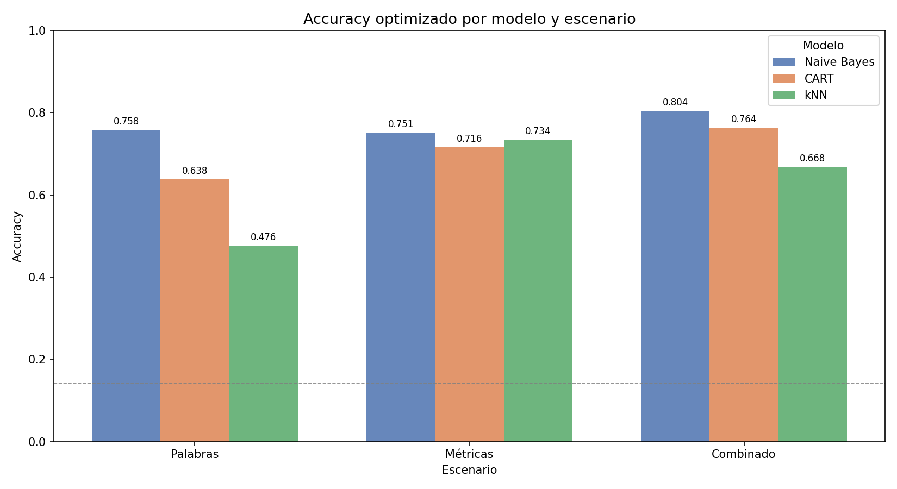

# Relational Machine Learning on the Cora Citation Network

This repository contains an academic machine learning project developed by **Enrique Julio Purcell Cichy** and **Jose Antonio Reina Navarro**.

The goal of the project is to study whether the structure of a citation graph can help classify scientific papers by topic. We work with the **Cora dataset**, where each paper has textual attributes and citation links to other papers. Instead of using only the original word features, we build a graph and extract relational metrics with **NetworkX**, then use those metrics as features for classical predictive models in **scikit-learn**.

The models used here are intentionally foundational: **Naive Bayes**, **CART decision trees** and **k-nearest neighbors**. The interesting part of the project is not model complexity, but the full pipeline: data processing, graph construction, relational feature engineering, model comparison and interpretation.

## Project Summary

We compare three feature scenarios:

1. **Original attributes**: binary word indicators from the Cora dataset.
2. **Relational metrics**: graph-based features extracted from the citation network.
3. **Combined features**: original word attributes plus relational graph metrics.

The relational metrics include:

- degree
- degree centrality
- betweenness centrality
- closeness centrality
- clustering coefficient
- PageRank
- Louvain community detection

The final objective is to evaluate whether adding graph information improves node classification.

## Dataset

The project uses the public **Cora citation dataset** from LINQS.

Basic dataset information:

- **2708** scientific papers
- **1433** binary word attributes
- **7** topic classes
- **5429** citation relationships

Each paper is represented as a node, and each citation is represented as a directed edge.

## Methodology

The workflow is organized as follows:

1. Load and clean the Cora content and citation files.
2. Build a directed citation graph with NetworkX.
3. Build an undirected version of the graph for metrics where edge direction is not relevant.
4. Compute relational graph metrics.
5. Build three feature sets: original, relational and combined.
6. Train and evaluate Naive Bayes, CART and kNN.
7. Use `Pipeline`, `ColumnTransformer`, cross-validation and `GridSearchCV` where appropriate.
8. Compare base and optimized models.
9. Select the best final model.

Some preprocessing decisions:

- `KBinsDiscretizer` is used to discretize continuous graph metrics for `CategoricalNB`.
- `MinMaxScaler` is used for kNN because distance-based models are sensitive to feature scale.
- `OneHotEncoder` is used for Louvain communities in CART and kNN, since community IDs are categorical and not ordinal.
- PageRank is computed on the directed graph.
- Clustering coefficient and Louvain communities are computed on the undirected graph.

## Models

| Model | Purpose |
|---|---|
| Naive Bayes | Strong baseline for discrete high-dimensional data |
| CART | Interpretable decision tree model |
| kNN | Distance-based classifier to test structural similarity between papers |

## Main Results

Final comparison using optimized models:

| Feature set | Naive Bayes | CART | kNN |
|---|---:|---:|---:|
| Original word attributes | 0.7583 | 0.6384 | 0.4760 |
| Relational metrics | 0.7509 | 0.7159 | 0.7343 |
| Combined features | 0.8044 | 0.7638 | 0.6679 |

The best absolute result was obtained by the **base Naive Bayes model with combined features**:

```text
Accuracy: 0.8063
Model: CategoricalNB
Features: original word attributes + relational graph metrics
```



## Key Takeaways

- Relational graph metrics contain useful predictive information for classifying papers.
- Naive Bayes benefits the most from combining textual and graph-based features.
- kNN performs much better with relational metrics than with the original high-dimensional word attributes.
- CART provides useful interpretability, especially through the Louvain community feature.
- The project shows how classical ML models can be strengthened with graph-based feature engineering.

## Repository Guide

The notebooks are ordered according to the project workflow:

1. `notebooks/01_exploracion_cora.ipynb`  
   Initial dataset exploration and graph construction.

2. `notebooks/02_metricas_relacionales.ipynb`  
   Computation of graph metrics such as centrality, clustering, PageRank and Louvain communities.

3. `notebooks/03_naive_bayes.ipynb`  
   Naive Bayes training, evaluation and hyperparameter search.

4. `notebooks/04_cart.ipynb`  
   CART decision tree models, feature importance and tree visualization.

5. `notebooks/05_KNN.ipynb`  
   kNN models with scaling, encoding and hyperparameter search.

6. `notebooks/06_Comparacion_Modelos.ipynb`  
   Global comparison of all models and feature scenarios.

7. `notebooks/07_modelo_final.ipynb`  
   Reconstruction and evaluation of the selected final model.

## Repository Structure

```text
data/
  raw/              Original Cora files
  processed/        Processed content, citations and relational metrics

notebooks/          Full analysis and modeling workflow
reports/            Generated plots, trees and comparison figures
slides/             Presentation material and project notes
src/                Helper scripts used during project preparation
```

## How to Run

Create a Python environment and install the dependencies:

```bash
pip install -r requirements.txt
```

Then run the notebooks in order:

```text
01 -> 02 -> 03 -> 04 -> 05 -> 06 -> 07
```

The later notebooks depend on the processed files generated by the earlier ones.

## Tech Stack

- Python
- pandas
- NumPy
- NetworkX
- scikit-learn
- python-louvain
- matplotlib
- seaborn
- Jupyter Notebook

## Scope

This is an academic project focused on understanding the full process of relational machine learning with graph-derived features. The models are simple by design, but they provide a solid foundation for more advanced graph learning approaches such as node embeddings or graph neural networks.

